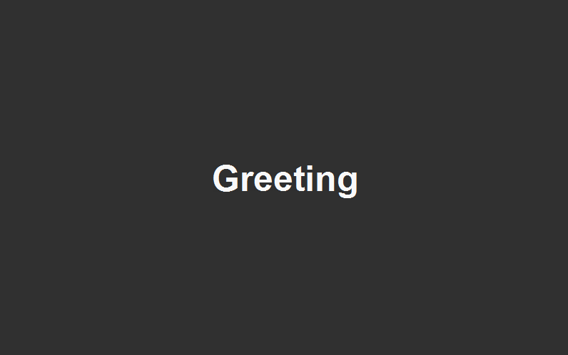
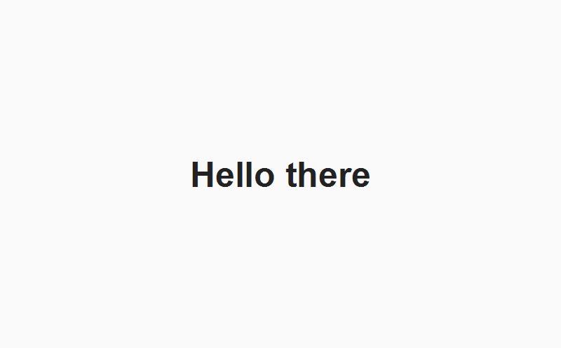

# GreetingWindow

## Что это и зачем нужно?
Иногда хочется добавить в программу что-то наподобие окна приветствия, которое бы предшествовало основной программе. Данный проект является вот таким окном приветствия.

Окно написано на javaFX и представляет из себя заготовку для использования в javaFX проектах в виде **модуля**.

## Как подключить?
Есть 2 варианта:
1. Клонировать репозиторий/скачать zip и добавить исходники в код проекта.
2. Скачать jar-файл *(находится в разделе releases)* и подключить его.

### Подключение jar к проекту
Подключить локальный jar через **Maven** можно примерно следующим способом (необходимо поместить в папку resources (см. [Maven Standart Directory Layout](https://maven.apache.org/guides/introduction/introduction-to-the-standard-directory-layout.html)), но можно и в любую другую папку, только нужно сообщить о ней Maven):
```
<dependency>
    <groupId>greetingwindow</groupId>
    <artifactId>greetingwindow</artifactId>
    <version>0.1.0</version>
    <scope>system</scope>
    <systemPath>${project.basedir}/src/main/resources/greetingwindow-0.1.0-SNAPSHOT.jar</systemPath>
</dependency>
```

Если не используется система сборки, то необходимо указать аргументы компилятора: 
* добавить путь к jar в *--module-path*
* указать "*greetingwindow*" в параметре *--add-modules*

### Подключение модуля `greetingwindow` к проекту.
Необходимо указать модуль в файле `module-info.java` своего проекта
Пример файла `module-info.java`:
```
module com.example {
    requires javafx.controls;
    requires greetingwindow;
    exports com.example;
}
```

## Кратко о возможностях
Методы класса `GreetingWindow` предоставляют следующие возможности:
* создание отдельного окна и анимации для него;
* преврарительная настройка **некоторых** *(см. раздел ограничений)* параметров окна и анимации средствами `GreetingWindow`;
* возможность поставить наблюдателя на событие завершения анимации;
* автозакрытия окна после завершения анимации *(по желанию)*.

## Примеры использования

### Пример 1
Простое появление и исчезновение текста с желаемой скоростью анимации.
```
    // Можно передать имя заголовка окна в аргументы, а можно и без него. Заголовок будет отображаться в панели задач внизу.
    GreetingWindow gw = new GreetingWindow("Greeting");

    // Многие методы возвращают тот же объект GreetingWindow для удобства вызова методов в цепочке
    gw.setTimeOfWindowAppearanceInMills(2000)
        .setTimeOfTextAppearanceInMills(1000);
        
    // Метод вшивает анимации на момент вызова Stage.show().
    // Также указываем, что нужно создать появление окна и текста, а также исчезновение окна и текста.
    Stage gwStage = gw.createStageWithAnimationOnShowing(AnimaTarget.BOTH, AnimaTarget.BOTH);
    gwStage.showAndWait();
```

Также можно сделать иначе - получить анимацию и `Stage` поотдельности и объединить вручную:
```
    GreetingWindow gw = new GreetingWindow("Greeting");
    gw.setTimeOfTextAppearanceInMills(2500);
    // Отображаемое имя на Stage.
    gw.setText("Hello there!");

    // Порядок важен! Сначала нужно получить окно - потом анимацию (вот так плохо спроектировано мною окно).
    Stage gwStage = gw.createGreetingWindow();
    // Здесь указываем, что появляться должен только текст, а исчездать текст и окно.
    Animation anima = gw.createAnimation(AnimaTarget.ONLY_TEXT, AnimaTarget.BOTH);

    // Так как последовательное получение Stage и Animation не сшивает анимацию со Stage, делать это придется вручную.
    gwStage.setOnShown((event) -> anima.play());
    gwStage.showAndWait();
```

### Пример 2
Теперь добавим задержку после последней анимации, а также отключим автоматическое закрытие окна - вместо этого добавим наблюдателей, ожидающих конца всех анимаций.
```
    GreetingWindow gw = new GreetingWindow("Greeting");
    // По умолчанию автозакрытие всегда включено включено.
    gw._needToCloseStageAtEndOfAnimation = false;

    // Полный список задержек выглядит следующим образом: (1) + Stage_in + (2) + Text_in + (3) + Text_out + (4) + Stage_out + (5)
    // Задержки представлены числами в скобках.
    // При 2х начальных анимациях из 4х, получается, что нужно сделать задержку после появления текста (то есть в (3)).
    Stage gwStage = gw.createStageWithAnimationOnShowing(AnimaTarget.BOTH, AnimaTarget.NO_ANIMATION, new int[] {0, 0, 3000});

    // Укажем метод, который необходимо вызвать после завершения анимаций.
    // В данном случае в коллекцию прослушивателей нужно добавить реализацию интерфейса IAnimationWatcher в виде лямда-выражения.
    gw.observersList.add(() -> Example2.callableFunction(gwStage));

    // Второй способ добавления прослушивателя - анонимный класс.
    gw.observersList.add(new IAnimationWatcher() {
        public void invokeAfterAnimation() {
            // DoSomeStuff or call methods
        }
    });

    gwStage.showAndWait();
```

В вызываемом методе просто закроем окно вручную, так как отключили автозакрытие:
```
    public static void callableFunction(Stage stage) {
        System.out.println("Animation end!");
        stage.close();
    }
```

### Пример 3
Создание окна без анимаций и его автозакрытие.

Проблема в том, что оповещение наблюдателей и автозакрытие привязывается к анимациям, и их отсутствие делает подобные действия невозможными.
В примере предлагается решение.
```
    GreetingWindow gw = new GreetingWindow();

    // Не стоит включать этот параметр при наличии каких-либо видимых анимаций, иначе они начинают лагать.
    gw.enableShadowOnText = true;

    // Если анимаций к форме не прикреплено, то никакие наблюдатели не вызовутся, а автозакрытие не произойдёт.
    // Поэтому всё-таки придется сделать псевдо-анимацию, но очень быструю.
    gw.setTimeOfWindowAppearanceInMills(1);

    // После этого необходимо создать окно с одной лишь быстрой анимацией.
    // Чтобы произошла задержка после окончания анимации можно либо выключить автозакрытие, либо добавить задержку.
    Stage gwStage = gw.createStageWithAnimationOnShowing(
        AnimaTarget.ONLY_WINDOW, AnimaTarget.NO_ANIMATION, new int[] {0, 5000}, true);

    gw.observersList.add(() -> {System.out.println("End of animation");});
    gwStage.showAndWait();
```

Также можно сделать закрытие в обход `GreetingWindow`, однако в этом случае не будет работать оповещение наблюдателей (так как оно прикрепляется к последней анимации):
```
    GreetingWindow gw = new GreetingWindow();
    Stage stage = gw.createGreetingWindow();

    // Создание самостоятельной анимации в виде простого ожидания.
    Animation delay = gw.createDelay(3000);

    // Закрытие окна при окончании анимации
    delay.setOnFinished((event) -> stage.close());

    // Прикрепление анимации к моменту отображения окна.
    stage.setOnShowing((event) -> delay.play());

    stage.show();
```

## Более подробно про ограничения и возможности

### Основные классы для взаимодействия
Основные классы для взаимодействия с пользователем: [GreetingWindow.java](src/main/java/nongroup/GreetingWindow.java), а также перечисление [AnimaTarget.java](src/main/java/nongroup/AnimaTarget.java), которое позволяет определить, для чего необходимо создать анимацию.

### Настройка окна и анимации средствами `GreetingWindow`
У окна можно настроить следующие характеристики:
* цвет текста, цвет фона, цвет тени текста;
* включить/выключить тень вокруг текста (из-за неё тормозит анимация);
* текст, выводимый окном;
* иконку окна и заголовок окна.

У анимации можно настроить следующие характеристики:
* задержки между анимация;
* длительность анимации появления/исчезновения окна/текста;
* что именно будет анимировано во время появления и во время исчезновения (например, использовать анимацию появления для окна и текста, но не использовать анимацию исчезновения вовсе).

### Ограничения
* производить настройку окна необходимо *до момента* получения `Stage`, так как в момент создания производится настройка в соответствие со всеми выставленными флагами;
* если используются раздельные методы получения `Stage` и `Animation`, тогда должен соблюдаться строгий порядок - `Stage` создаваться первым, а анимация создаваться уже после.
* некоторые настройки окна `GreetingWindow` не подразумевает, например, изменение размеров или расположения окна приветствия. Однако это можно настроить вручную, получив через один из методов объект `Stage`, и настроив некоторые его параметры до вызова `stageObj.show()`;
* предусмотрен только 1 вид анимация: постепенное изменение прозрачности;
* предусмотрен только 1 элемент на форме - `Label` с текстом;
* окно не закроется автоматически, если не были созданы никакие анимации; по этой же причине наблюдатели вызваны не будут, так как их вызов прикрепляется к последней анимации.

### Как обойти некоторые ограничения
Так как `GreetingWindow` возвращает как объект `Stage`, так и `Animation`, провести более тонкую настройку можно, работая напрямую с ними после их создания.

## Скриншоты окна

### Вид без изменений


### Изменения вида средствами `GreetingWindow`



